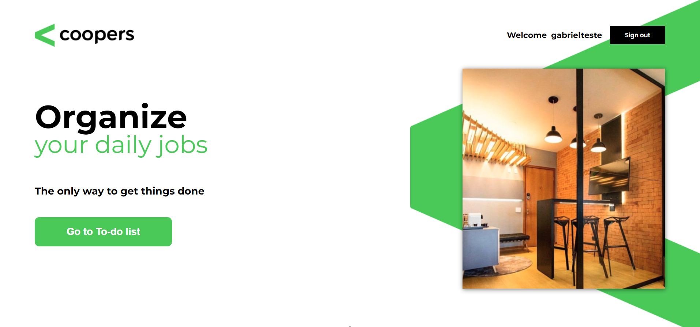

<!-- TITLE -->
<h1 align="center" color="black"><a href="https://coopers-pearl.vercel.app/" target="_blank">Coopers</a></h1>

<!-- THUMB -->

  

<!-- STATUS -->

---

<!-- DESCRIPTION -->

 
        💡 
        O projeto é um aplicativo web que permite aos usuários criar listas de tarefas personalizadas. Foi desenvolvida uma API em Node.js para gerenciar as interações da aplicação, como adicionar, editar e excluir tarefas. Tudo foi criado durante um teste para um processo seletivo. É uma forma simples e prática de organizar tarefas e aumentar a produtividade.
    

<!-- INTRO -->

## Índice

- [Tecnologias](#tecnologies)
- [Implementação](#implementation)
- [Funcionalidades](#features)
- [Requerimentos de qualidade](#quality)
- [Instruções de Uso](#glossary)
- [Autor](#authors)

## Tecnologias 

- React
- Swap (Slides)
- Sass
- Axios (API)

## Implementação 

O primeiro passo no desenvolvimento do projeto consiste em elaborar um README detalhado, que compreenda todos os requisitos essenciais para a execução do mesmo, abrangendo tanto os requisitos gerais como os específicos da aplicação.

- Os requisitos gerais serão serão na maior parte, não funcionais;

- Os requisitos da aplicação serão todas as funcionalidades principais para finalização  do projeto.

Após a conclusão dessa etapa, o próximo passo é analisar e estruturar o layout do projeto, que será dividido em diversas seções, tais como o cabeçalho (Header), a seção principal (Main Section), o artigo (Article), a seção de formulário (Form Section) e o rodapé (Footer).

Por fim, após a organização e separação da aplicação em partes distintas, inicia-se à execução de cada requisito. Cada funcionalidade a ser implementada será dividida em pequenas partes, tornando mais fácil a visualização e execução das tarefas necessárias para o cumprimento de cada objetivo.

## Funcionalidades 

- Montagem de CRUD (Criar, Ler, Atualizar, Deletar);
- Funcionalidade de drag-and-drop, exclusão e adição de tarefas;
- Utilização de React e Node.js;
- Implementação de login/senha para acesso com credenciais;
- Hospedagem da aplicação no Heroku.

## Requerimentos de qualidade 

- Responsividade
- Performance
- Sustentável

## Instruções de Uso 

- Certifique-se de ter o Node.js instalado em seu sistema. Em seguida, execute o seguinte comando para instalar as dependências do projeto:

`npm install`

 

- Para iniciar o servidor de desenvolvimento local, utilize o seguinte comando:

`npm run dev`

O sistema estará disponível em http://localhost:5000/. As alterações no código serão recarregadas automaticamente no navegador durante o desenvolvimento.

 

- Para criar a versão final do projeto otimizada para produção, execute o seguinte comando:

`npm run build`

Os arquivos finais serão gerados na pasta 'build'. Lembrando que para o funcionamento correto da aplicação será necessario estabelecer conexão com um serviço para tratamento de requisições.

## Autor 

- [@Gabriel Assunção](https://github.com/zDeep10) - Ideia e Construção
